# Projeto de Contador - Sistemas Digitais  
**Pedro Arthur Oliveira dos Santos**  
**Lucas Matheus da Silva Lima**  
**Data:** _10 de maio de 2025_  

---

## Sumário

- [Introdução](#introdução)
- [Referencial Teórico](#referencial-teórico)
  - [Lógica Sequencial](#lógica-sequencial)
    - [Latch SR](#latch-sr)
    - [Flip-Flop](#flip-flop)
      - [Flip-Flop JK](#flip-flop-jk)
      - [Flip-Flop D](#flip-flop-d)
  - [Máquina de Estados Finitos](#máquina-de-estados-finitos)
    - [Variáveis de Estado](#variáveis-de-estado)
  - [Soma em BCD](#soma-em-bcd)
    - [Soma Menor ou Igual a 9](#soma-menor-ou-igual-a-9)
    - [Soma Maior que 9](#soma-maior-que-9)
- [Projeto](#projeto)
  - [Projetando os Blocos do Circuito](#projetando-os-blocos-do-circuito)
  - [Somador BCD](#somador-bcd)
  - [Multiplexador de 2 Canais](#multiplexador-de-2-canais)
- [Conclusão](#conclusão)
- [Referências Bibliográficas](#referências-bibliográficas)

---

## Introdução

Este relatório descreve os procedimentos realizados para a concepção do primeiro projeto da disciplina de Sistemas Digitais (ELE3515). Foi proposto projetar um contador, para realizar várias operações com dois números de 8 bits, além dos códigos em VHDL e testes no kit da DE2.

Trata-se de um projeto de circuito digital a nível de componentes menores que podem ser combinados a fim de formar vários componentes maiores para fazer as operações em todos esses números de bits.

A Figura abaixo mostra detalhadamente o esquema inicial do projeto proposto.

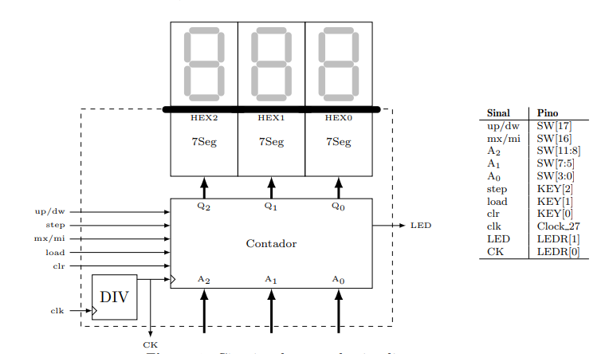

---

## Referencial Teórico

O projeto do contador inclui dois conteúdos importantíssimos dos livros de sistemas digitais: lógica combinacional e lógica sequencial. Especialmente a lógica sequencial introduz novos elementos à teoria dos circuitos digitais, que agora além da lógica combinacional, exige circuitos capazes de armazenar estados.

### Lógica Sequencial

Circuitos combinacionais produzem uma saída diferente para cada entrada [1], porém há circuitos que não seguem esse comportamento — os chamados circuitos sequenciais. Eles podem produzir saídas diferentes para as mesmas entradas, de acordo com variáveis internas chamadas variáveis de estado [1]. Essas variáveis são úteis para descrever circuitos que seguem uma lógica interna e armazenam bits.

#### Latch SR

Um circuito com realimentação que consegue armazenar o estado atual é o Latch SR, com entradas SET e RESET. Dependendo das entradas, ele mantém o estado anterior da saída [1]. A topologia usando portas NOR está na figura abaixo.

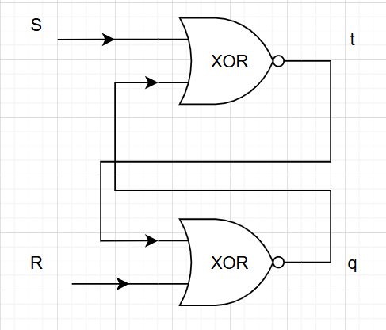

As equações do circuito são:

$$
t^{i+1} = \overline{S+Q^i} = \overline{S} \cdot \overline{Q^i}
$$

$$
Q^{i+1} = \overline{R+t^i} = \overline{R} \cdot \overline{t^i}
$$

Substituindo (1) em (2):

$$
Q^{i+1} = \overline{R} \cdot \overline{ \overline{S} \cdot \overline{Q^i} }
$$

Aplicando a Lei de De Morgan:

$$
Q^{i+1} = \overline{R} \cdot ( S + Q^i ) = \overline{R} \cdot S + \overline{R} \cdot Q^i  
$$

Essa equação mostra que, enquanto SET permanecer inalterado, a saída futura será igual à passada.

#### Flip-Flop

Um flip-flop é um circuito digital que, quando pulsado, pode armazenar 1 bit. Muitos flip-flops têm entrada *clear*, usada para zerar a saída. A pulsação (clock) determina se o flip-flop atualiza ou retém o valor na saída, conforme a equação característica [1].

##### Flip-Flop JK

O flip-flop JK aprimora o funcionamento do flip-flop SR, interpretando S = R = 1 como comando de inversão [2]. Os comandos:

- J = 1, K = 0 → Set  
- J = 0, K = 1 → Reset  
- J = K = 1 → Toggle (inversão)  

Equação característica:

$$
Q^{i+1} = J \cdot \overline{Q^i} + \overline{K} \cdot Q^i
$$

Ele também pode dividir a frequência de entrada (divisor de frequência). Veja a figura:

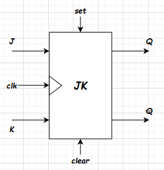

##### Flip-Flop D

Muito utilizado em registradores, o flip-flop D armazena bits de forma seletiva [2]. A equação característica:

$$
Q^{i+1} = D \cdot clk^{\uparrow}
$$

Ou seja, a saída é igual à entrada nas bordas de subida.

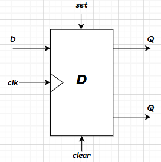

---

### Máquina de Estados Finitos

Em muitos casos, circuitos digitais operam de acordo com estados definidos por variáveis internas [2]. A representação dos estados e transições é chamada de máquina de estados finitos — fundamental em projetos digitais.

#### Variáveis de Estado

As variáveis de estado determinam as transições entre os estados do sistema.

---

### Soma em BCD

Para realizar somas em BCD (Binary-Coded Decimal), somamos unidades com unidades, dezenas com dezenas. Existem dois casos:

#### Soma Menor ou Igual a 9

Somamos normalmente em binário:

$$
0101 + 0100 = 1001
$$

#### Soma Maior que 9

Neste caso, soma-se binário + 6 para correção. Exemplo: 6 + 7 = 13

$$
0110 + 0111 = 1101
$$

$$
1101 + 0110 = 0011
$$

Com carry:

$$
0110 + 0111 = 0001 \: 0011
$$

---

## Projeto

### Projetando os blocos do circuito
Um contador é um circuito sequencial que transita entre estados, para o contador que será descrito neste relatório, tem algumas fases mais complexas, uma vez que o seu passo pode ser variável e ele pode ser crescente ou decrescente.

### Somador BCD
Utilizando o componente somador completo de 1 bit, mostrado anteriormente, é possível, cascateando 8 somadores em série, fazer um somador justamente de 8 bits, como mostra a figura abaixo.

### Mux de 2 Canais
Para fazer escolher, normalmente o componente escolhido é o multiplexador, que faz a escolha baseado na chave seletora [vahid].
Podemos fazer um mux de 2 canais, cada canal com 12 bits, para esse propósito.

Um multiplexador 2:1 possui duas entradas de dados ($I_0$ e $I_1$), uma linha de seleção $S$, e uma única saída $Y$.

*Figura: Esquemático do multiplexador simples*

A tabela verdade para todas as combinações possíveis de entrada é apresentada a seguir:

| **S** | **$I_0$** | **$I_1$** | **Y** |
|---|---|---|---|
| 0 | 0 | 0 | 0 |
| 0 | 0 | 1 | 0 |
| 0 | 1 | 0 | 1 |
| 0 | 1 | 1 | 1 |
| 1 | 0 | 0 | 0 |
| 1 | 0 | 1 | 1 |
| 1 | 1 | 0 | 0 |
| 1 | 1 | 1 | 1 |
*Tabela: Tabela verdade do multiplexador 2:1.*

Utilizando agora o conceito de soma de produtos, a expressão que pode ser obtida pela tabela é:

$$ Y = S'I_0I_1' + S'I_0I_1 + SI_0'I_1 + SI_0I_1 $$

agora usando as propriedades da algebra booleana, temos pela propriedade distributiva inversa, que:

$$ Y = S'I_0(I_1' + I_1) + SI_1(I_0' + I_0) $$

Utilizando mais uma vez a propriedade do elemento oposto ou complemento, a expressão simplificada do multiplexador é dada por

$$ Y = S'I_0 + SI_1 $$

Jutando vários multiplexadores em parelelo para cada bit, mantendo a posição dos bits referente a cada canal, é possível fazer um multiplexador que transmita um vetor de bits, ao invés de um único bit.
Nesse projeto, as entradas para esses multiplexadores são vetores de 12 bits, que são usados para representar as variáveis principais de contagem.

Nesse contexto, podemos representar as entradas $I_0$ e $I_1$ vetorialmente e a equação de saída do multiplexador se torna:

$$ Y^{(n)} = S'I_0^{(n)} + SI_1^{(n)} $$

### Comparador de 12 bits
Para continuar ou não a contagem, precisamos verificar se o número excede o máximo ou é menor que o mínimo, há algumas formas de fazer isso e o comparador de magnitude é a forma fundamental, ainda que a entrada esteja em bcd, podemos concatenar os digitos e fazer a comparação de forma igual.

### Registradores
Um registrador é um circuito feito para guardar o valor de um bit no seu interior até que ele mude, para isso precisamos de circuitos flip flops e também multiplexadores para controlar quando um registrador deve ser alterado(carregado) e quando deve permanecer com o mesmo valor [vahid].
Podemos implementar um registrador utilizando um Flip-flop D e um multiplexador, como é mostrado na figura abaixo.

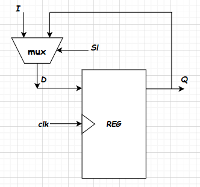
*Figura: Registrador Básico*

A chave seletora do mux de um registrador é chamada de *load*, e seu nome tem justamente o significado de carregar um valor para a saída do registrador, somente quando essa chave for ativa.

A equação do multiplexador é dada por

$$ D = \overline{ load } \cdot Q + load \cdot I $$

Porém a saída do registrador é o valor da entrada, apenas nas bordas de subida, assim

$$ Q^{i+1} = (\overline{ load } \cdot Q^i + load \cdot I) \cdot clk^{\uparrow} $$

Ou seja, o valor $Q$ guardado no registrador so vai ser determinado pela entrada I quando a entrada $load$ estiver ativa e houver uma borda de subida, e isso é a forma fundamental de armazenamento de bits.

### Decodificador com Enable
Precisamos carregar os valores em BCD para as entradas do circuito, e como o registrador tem uma entrada load, para permitir a escrita do dado no registrador, precisamos que só aconteça o load quando fomos operar para colocar esses valores.
Um jeito fácil de fazer isso é utilizando um decodificador com enable, onde o enable é a entrada load do contador, que em conjunto com as entradas de habilitação do passo e dos limites, nos permite escrever nos registradores que quisermos, a hora que quisermos [vahid].
A figura do decodificador de 2 bits é mostrada abaixo

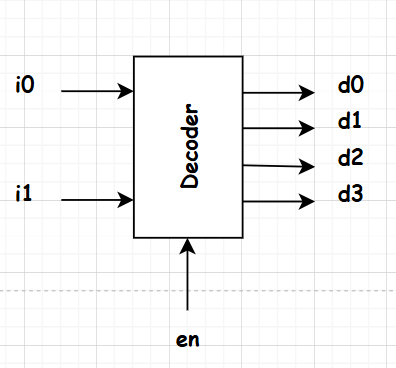
*Figura: decodificador*

A tabela verdade do decodificador com enable é mostrada abaixo.

| i_0 | i_1 | d_0 | d_1 | d_2 | d_3 |
|---|---|---|---|---|---|
| 0 | 0 | 1 | 0 | 0 | 0 |
| 0 | 1 | 0 | 1 | 0 | 0 |
| 1 | 0 | 0 | 0 | 1 | 0 |
| 1 | 1 | 0 | 0 | 0 | 1 |
*Tabela: Tabela Verdade para o decodificador com Enable*

Com essa tabela em mãos, conseguimos deduzir as expressões na forma de soma de produtos para obter a expressão lógica para cada saída, temos que

1.  $ d_0 = \bar{i_0} \cdot \bar{i_1} $
2.  $ d_1 = \bar{i_0} \cdot i_1 $
3.  $ d_2 = i_0 \cdot \bar{i_1} $
4.  $ d_3 = i_0 \cdot i_1 $

### Divisor de Frequência
O divisor de frequência é um circuito com Flip-flop JK, que tem a característica de dividir a frequência do sinal de clock da entrada por dois.
A configuração do flip-flop JK como dobrador de frequência é mostrada na figura abaixo

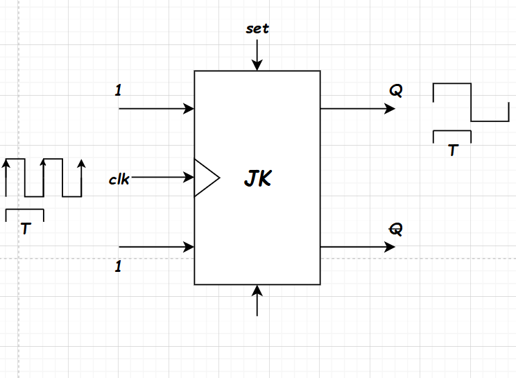
*Figura: Divisor de Frequência*

Aplicando a equação característica do flip-flop nessa configuração, temos

$$ Q^{\text{i+1}} = 1 \cdot \overline{Q^i} + \overline{1} \cdot Q^{i} = \overline{Q^i} \cdot clk^{\uparrow} $$

Ou seja, se demora um período $T$ para a borda de subida acontecer, irá demorar T segundos para a saída ir do positivo pro negativo ou vice versa, ou seja, um ciclo completo agora se dará em um período de $2T$, assim, se o período é dobrado, a frequência é dividida por 2, então temos finalmente a relação fundamental do divisor de frequência:

$$ \omega_Q = \frac{\omega_{clk}}{2} $$

### Display de 7 Segmentos
Por fim para mostrar o número, precisamos converter cada digito do número em BCD para decimal, ou seja, para mostrar no display de 7 segmentoos.
Para isso, podemos utilizar a algebra booleana e obter, a partir de uma tabela verdade, as espressões lógicas de cada led, de maneira bem intuitiva, ja que sabemos quais leds devem ligar para quais entradas.

| Decimal | A | B | C | D | a | b | c | d | e | f | g |
|---|---|---|---|---|---|---|---|---|---|---|---|
| 0 | 0 | 0 | 0 | 0 | 1 | 1 | 1 | 1 | 1 | 1 | 0 |
| 1 | 0 | 0 | 0 | 1 | 0 | 1 | 1 | 0 | 0 | 0 | 0 |
| 2 | 0 | 0 | 1 | 0 | 1 | 1 | 0 | 1 | 1 | 0 | 1 |
| 3 | 0 | 0 | 1 | 1 | 1 | 1 | 1 | 1 | 0 | 0 | 1 |
| 4 | 0 | 1 | 0 | 0 | 0 | 1 | 1 | 0 | 0 | 1 | 1 |
| 5 | 0 | 1 | 0 | 1 | 1 | 0 | 1 | 1 | 0 | 1 | 1 |
| 6 | 0 | 1 | 1 | 0 | 1 | 0 | 1 | 1 | 1 | 1 | 1 |
| 7 | 0 | 1 | 1 | 1 | 1 | 1 | 1 | 0 | 0 | 0 | 0 |
| 8 | 1 | 0 | 0 | 0 | 1 | 1 | 1 | 1 | 1 | 1 | 1 |
| 9 | 1 | 0 | 0 | 1 | 1 | 1 | 1 | 1 | 0 | 1 | 1 |
*Tabela: Tabela verdade para display de 7 segmentos (0 a 9)*

Por fim a lógica pode ser obtida e simplificada utilizando mapas de karnough, assim temos

1.  $ a = A + A'C +B'D' + BD $
2.  $ b = A + C'D' + CD + A'B' $
3.  $ c = A + BD' + CD + C' $
4.  $ d = A + B'C'D' + CD' + A'B'C + BC'D $
5.  $ e = B'C'D' + AC + AB + CD' $
6.  $ f = A + C'D' + BD' + BC' $
7.  $ g = A + B + C $

Que pode ser facilmente implementada no VHDL armazenando os sinais parciais que aparecem nas operações de cada LED.

### Circuito Completo do Contador
Por fim, juntando todos esses componentes, o contador é estruturado conforme a figura abaixo, os registradores, suas seleções de entradas e o circuito de contagem são paralelizados, mas como o circuito é síncrono, é atualizado assim que houver uma borda de subida.

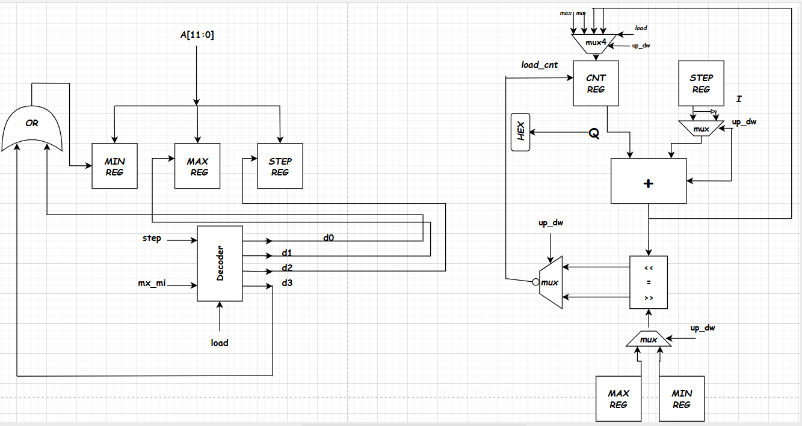
*Figura: Arquitetura Contador*

## Implementação
A implementação do VHDL foi feita seguindo as especificações dos componentes discutidos no capítulo anterior, sobre cada projeto, assim fizemos os componentes maiores a partir dos componentes fundamentais discutidos no capítulo Referencial teórico e sobre o diagrama do projeto mostrado na seção anterior.

### Código VHDL
Os códigos VHDL foram feitos utilizando os blocos de componentes principais discutidos no capítulo de Projeto, e se encontram no repositório do projeto cujo link é dado abaixo:

<https://github.com/PedroDS4/Projeto_Contador/tree/main/Codigos_VHDL>

### Implementação no Kit da DE2
Com a ajuda do professor, foi utilizando o software *Quartus II*, carregado o código VHDL do projeto desenvolvido e feita as verificações de Sintaxe, além disso também foi preciso consultar o manual do KIT da DE2, no site [manual_DE2], para conectar os pinos de todas as entradas e saídas do projeto, as saídas foram mapeadas para os display HEX da FPGA, assim como o led de sinalização para o LED[0] e o clock com frequência dividida para os dois primeiros LED's da sequência, além da chave seletora que foi direcionada para os botões e as entradas A e B para os switches [SW].

## Resultados
Depois da implementação do código em VHDL, foi feita a simulação no modelsim, foram realizadas três simulações onde foram testadas a soma de dois números, a multiplicação, e também a subtração.

### Simulação no Modelsim
Foi então realizada uma simulação, com os valores padrão por 10 ns, com um clock de $f = 4Ghz$, na configuração padrão.
Depois foram carregados os valores com de $Min = 50$, $Max = 100$ e $Step = 1$ para fazer uma contagem crescente, utilizando as configurações de carregamento de cada entrada.

Podemos ver que a partir de $1ns$, o circuito executou a contagem na configuração padrão e contou corretamente de $0$ até $21$, terminando em $10.5 ns$.

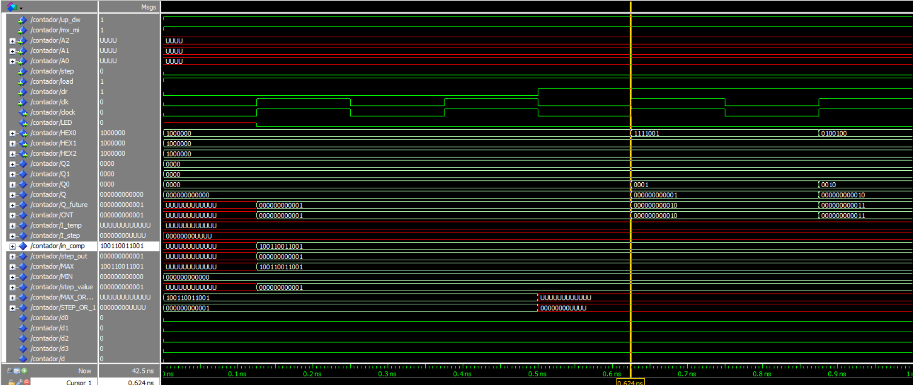
*Figura: Primeira Parte da Simulação no Modelsim*

Logo depois, instantâneamente as entradas foram carregadas para o máximo, mínimo e step, e a partir de $16.625 ns$ o circuito executou a contagem partindo de $50$, que é o valor que a contagem começa, ja que ela é decrescente, continuando até o fim da contagem em $33 ns$, terminando no valor de $100$, que é justamente o valor máximo, e a simulação continuou até $46 ns$ com o valor da contagem inalterado, como o esperado.

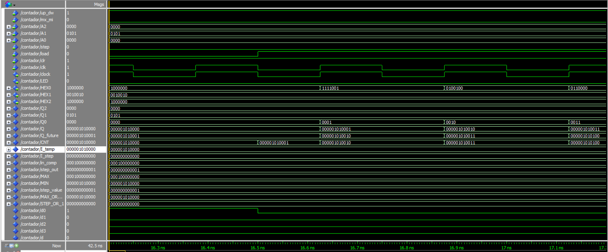
*Figura: Segunda Parte da Simulação no Modelsim*

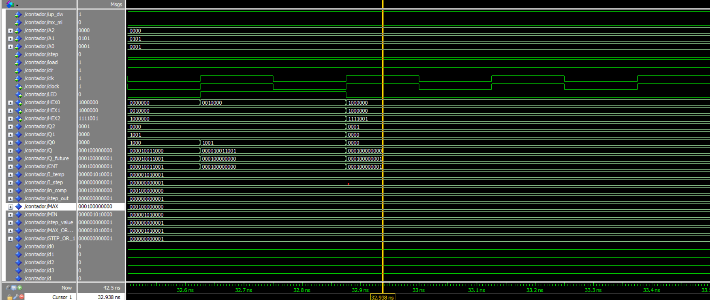
*Figura: Terceira Parte da Simulação no Modelsim*

### Implementação no Kit da DE2
No kit da DE2, foram realizados as análises de sintaxe, com alguns warnings mas sem nenhum erro, além disso também foi realizada a compilação completa, e o planejamento de pinos de acordo com o manual da Altera [manual_DE2].

## Conclusão

Neste relatório foi descrita toda a concepção teórica do projeto de contador com circuitos digitais básicos. O desenvolvimento em VHDL e os testes na placa DE2 completam o ciclo prático da disciplina.

---

## Referências Bibliográficas

[1] Frank Vahid, *Sistemas Digitais: Design com VHDL*, Bookman, 2008.  
[2] Ronald J. Tocci, Neal S. Widmer, Gregory L. Moss, *Sistemas Digitais: Princípios e Aplicações*, Pearson.

---
